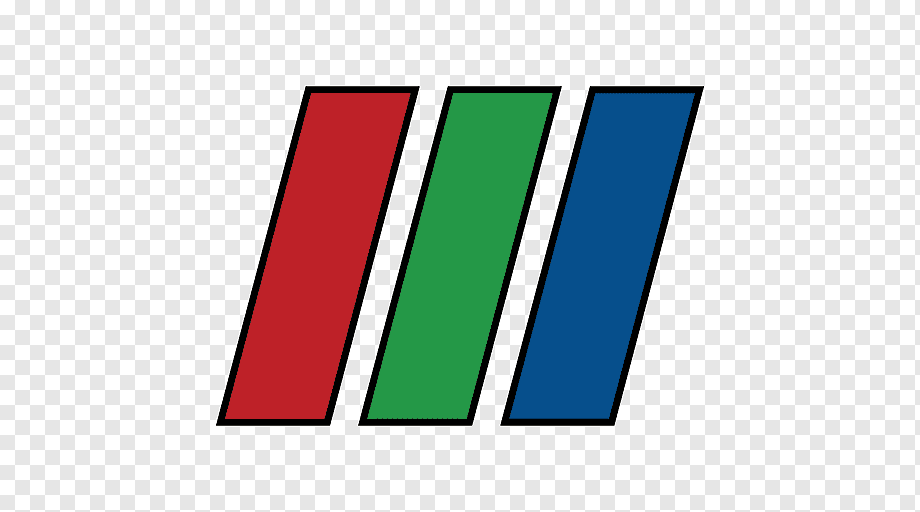

<h1 align="center">Hi there 👋, I'm Théo Duez</h1>

<h3 align="center"> Passionate by research, learning Mathematics 📈, Physics ⚛️and Computer Science 💻 </h3>

<h4 align="center"> I'm a Master student 👨‍🎓, currently enrolled both at CentraleSupélec with a conccurent degree at Paris-Saclay Univeristy in the Analysis-Modelisation-Simulation master's program. </h4>

---

username=Theozeud&show_icons=true&theme=white&locale=en&hide_border=true&include_all_commits=true&count_private=true" alt="Theozeud" />

<h3 align="left">Languages and Tools:</h3>

- Programming Languages:
    

        
        
        
        

    

- Scientific Tools
    

        
        

    

- Techs:
    

        
        

    

Some knowledge or experience in :

---
<h3> Differents projects I have worked on : </h3>

- From November 2022 to March 2023, I worked on simulation of two phase flows through the Lattice Boltzmann method in the C++ code LBM_saclay during an internship at CEA.

- From April 2023 to August  2023, during an internship in the group Geometric Numerical Integration and Reduced Complexity Modelling (in the division Numerical Modeling in Plasma Physics at Max Planck), I worked on Scientifique Machine Learning (PINN's).  I focused on different architectures as HNN, LNN, SympNet, RNN and LSTM with contributions in different Julia packages 
    - GeometricMachineLearning.jl,
    - AbstractNeuralNetworks.jl, 
    - EulerLagrange.jl, 
    - SymbolicNeuralNetwork.jl. 

<!--
**Theozeud/Theozeud** is a ✨ _special_ ✨ repository because its `README.md` (this file) appears on your GitHub profile.

Here are some ideas to get you started:

- 🔭 I’m currently working on ...
- 🌱 I’m currently learning ...
- 👯 I’m looking to collaborate on ...
- 🤔 I’m looking for help with ...
- 💬 Ask me about ...
- 📫 How to reach me: ...
- 😄 Pronouns: ...
- ⚡ Fun fact: ...
-->
