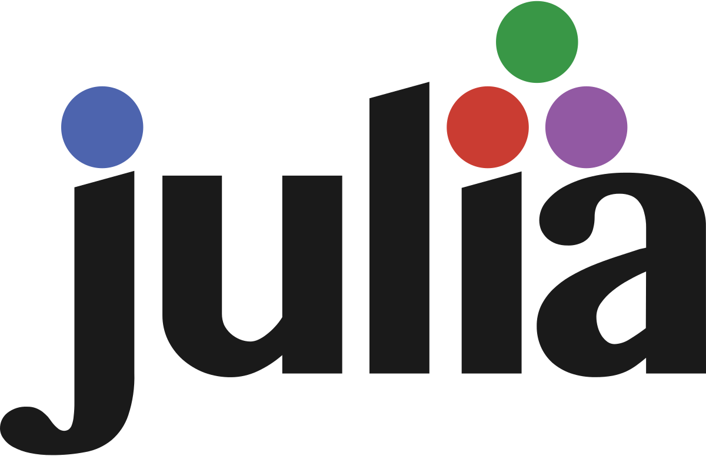

<h1 align="center">Hi there 👋, I'm Théo Duez</h1>

<h3 align="center"> Passionate by research, learning Mathematics 📈, Physics ⚛️and Computer Science 💻 </h3>

<h3 align="center"> I'm a Master student 👨‍🎓, currently enrolled both at CentraleSupélec with a conccurent degree at Paris-Saclay Univeristy in the Analysis-Modelisation-Simulation master's program.

---

<h3 align="left">Languages and Tools:</h3>

- Programming Languages:
    

        
        
        
        
        

<!--
**Theozeud/Theozeud** is a ✨ _special_ ✨ repository because its `README.md` (this file) appears on your GitHub profile.

Here are some ideas to get you started:

- 🔭 I’m currently working on ...
- 🌱 I’m currently learning ...
- 👯 I’m looking to collaborate on ...
- 🤔 I’m looking for help with ...
- 💬 Ask me about ...
- 📫 How to reach me: ...
- 😄 Pronouns: ...
- ⚡ Fun fact: ...
-->
